# Project: Application Load Balancer (ALB) with EC2 Target Groups

## Objective

Build a fully functional ALB setut:
- 1 VPC with 2 public subnets (different AZs)
- Internet Gateway + public routing
- ALB across both public subnets
- 2 EC2 instances (web-a and web-b) serving different pages
- Security groups ensuring EC2 is only reachable via ALB (not directly)
- Health checks on `/`
- Load balancing verified by refreshing ALB DNS

---

## Step 1 — Create the VPC

1. AWS Console → **VPC**
2. Your VPCs → **Create VPC**
3. Select **VPC only**
4. Name tag: `alb-lab-vpc`
5. IPv4 CIDR block: `10.0.0.0/16`
6. Click **Create VPC**

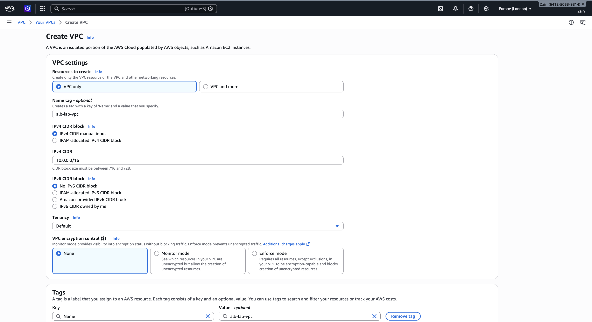

---

## Step 2 — Create 2 Public Subnets in Different AZs

VPC → Subnets → **Create subnet**

### Subnet 1: public-subnet-a

- VPC: `alb-lab-vpc`
- Subnet name: `public-subnet-a`
- Availability Zone: `eu-west-2a`
- IPv4 subnet CIDR: `10.0.1.0/24`

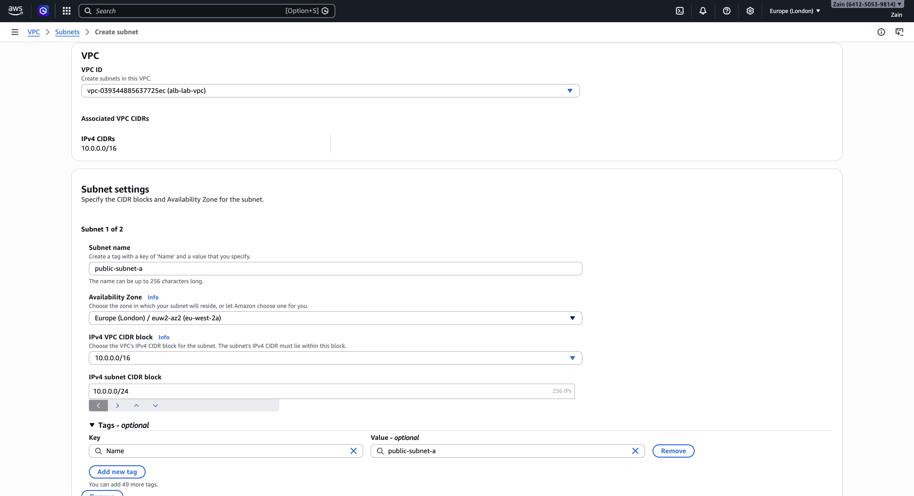

### Subnet 2: public-subnet-b

Click **Add new subnet**:

- Subnet name: `public-subnet-b`
- Availability Zone: `eu-west-2b`
- IPv4 subnet CIDR: `10.0.2.0/24`

Click **Create subnets**

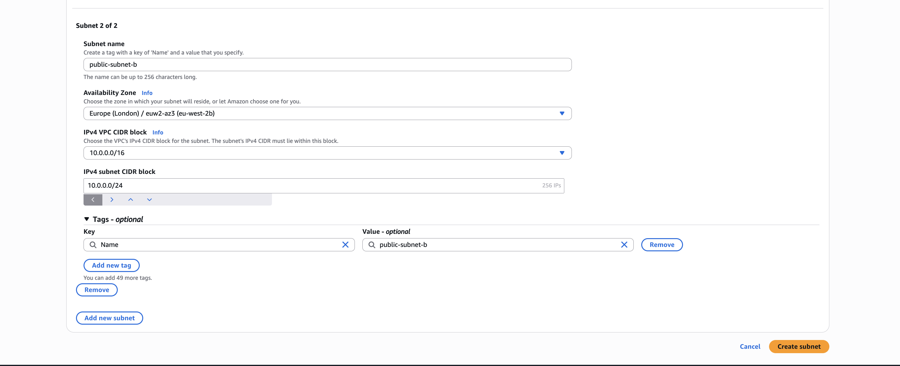

---

## Step 3 — Create and Attach an Internet Gateway (IGW)

1. VPC → Internet Gateways → **Create internet gateway**
2. Name: `alb-lab-igw`
3. Click **Create**
4. Select the IGW → Actions → **Attach to VPC**
5. Choose `alb-lab-vpc` → **Attach**

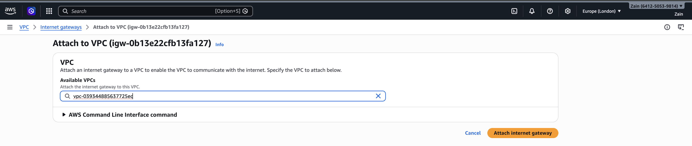

---

## Step 4 — Create a Public Route Table and Associate Both Subnets

### 4.1 Create route table

1. VPC → Route Tables → **Create route table**
2. Name: `alb-lab-rt-public`
3. VPC: `alb-lab-vpc`
4. Click **Create**

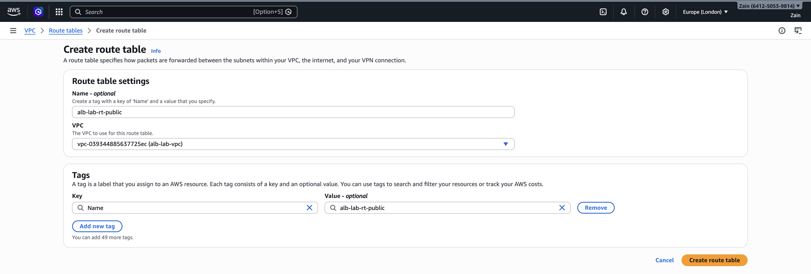

### 4.2 Add internet route

1. Select `alb-lab-rt-public`
2. Routes tab → **Edit routes** → **Add route**
3. Destination: `0.0.0.0/0`
4. Target: Internet Gateway → `alb-lab-igw`
5. Click **Save changes**

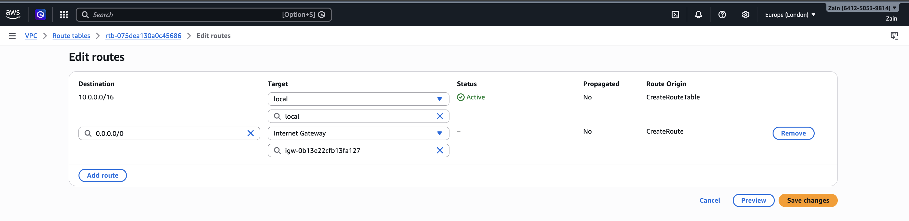

### 4.3 Associate both public subnets

1. In the same route table → Subnet associations → **Edit subnet associations**
2. Select both `public-subnet-a` and `public-subnet-b`
3. Click **Save associations**

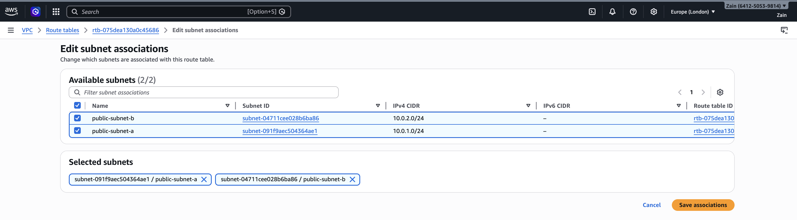

---

## Step 5 — Create Security Groups (ALB SG + EC2 SG)

### 5.1 ALB Security Group

1. EC2 → Security Groups → **Create security group**
2. Name: `alb`
3. Description: `ALB allows HTTP from internet`
4. VPC: `alb-lab-vpc`
5. **Inbound:** HTTP (80) from `Anywhere (0.0.0.0/0)`
6. **Outbound:** All traffic (default)

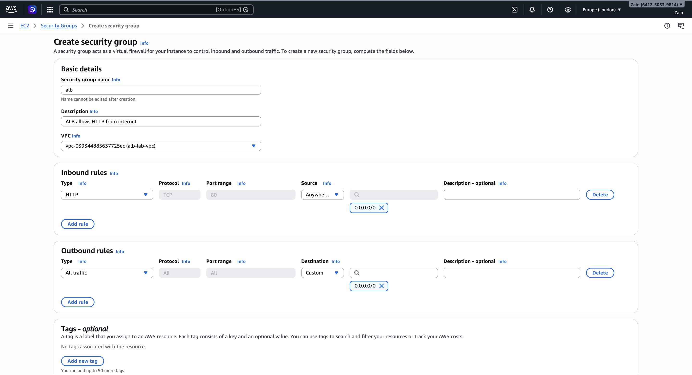

### 5.2 EC2 Security Group

1. Create another SG: `web`
2. Description: `Web instances only accept HTTP from ALB VPC: alb-lab-vpc`
3. VPC: `alb-lab-vpc`
4. **Inbound:** HTTP (80) source = `alb` security group (security group reference)
5. **Outbound:** All traffic (default)

> This is the key security control — EC2 instances only accept traffic from the ALB, not directly from the internet.

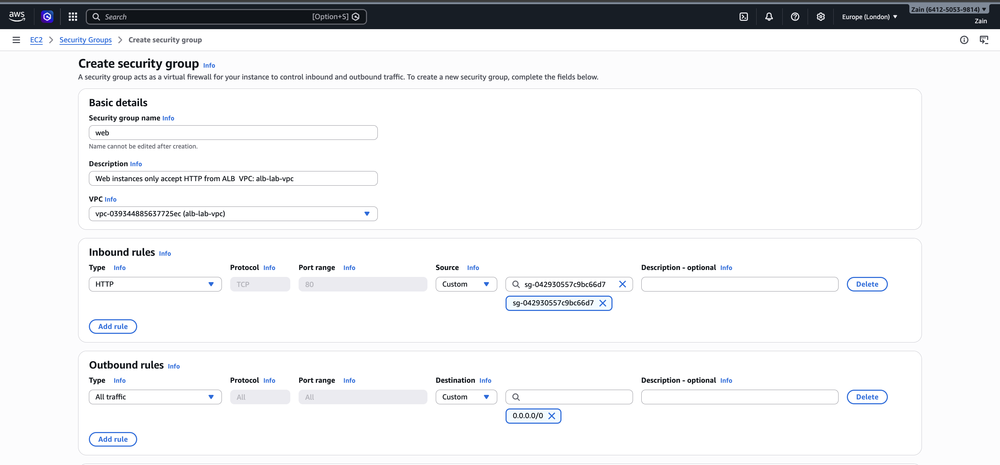

---

## Step 6 — Create Target Group

1. EC2 → Target Groups → **Create target group**
2. Target type: **Instances**
3. Target group name: `tg-web`
4. Protocol: **HTTP**
5. Port: **80**
6. VPC: `alb-lab-vpc`
7. Health check protocol: **HTTP**
8. Health check path: `/`
9. Click **Create target group**

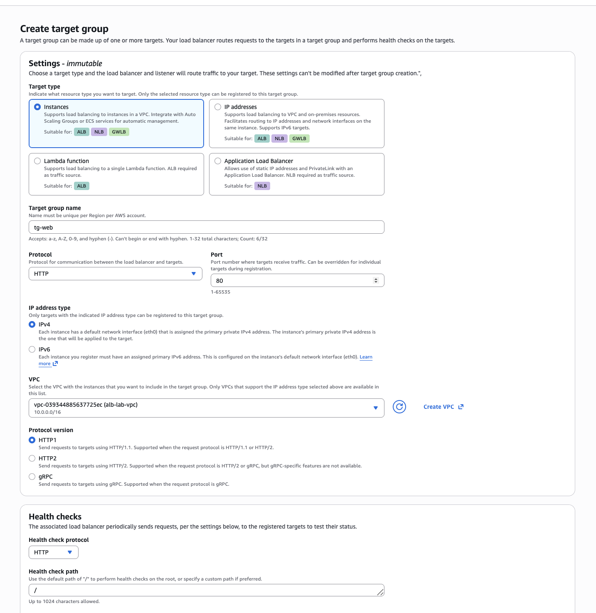

---

## Step 7 — Launch Two EC2 Instances with Different Content

### 7.1 User data for Instance A

```bash
#!/bin/bash
apt-get update -y
apt-get install -y nginx
echo "<h1>Web Server A</h1><p>Behind an ALB</p>" > /var/www/html/index.html
systemctl enable nginx
systemctl restart nginx
```

### 7.2 User data for Instance B

```bash
#!/bin/bash
apt-get update -y
apt-get install -y nginx
echo "<h1>Web Server B</h1><p>Behind an ALB</p>" > /var/www/html/index.html
systemctl enable nginx
systemctl restart nginx
```

### Launch web-a

1. EC2 → Instances → **Launch instance**
2. Name: `web-a`
3. AMI: **Ubuntu LTS**
4. Instance type: `t3.micro`
5. Key pair: `web-a`
6. Network settings:
   - VPC: `alb-lab-vpc`
   - Subnet: `public-subnet-a`
   - Auto-assign public IP: **Disable**
   - Security group: `web`
7. Advanced details → User data: paste Instance A script
8. Click **Launch instance**

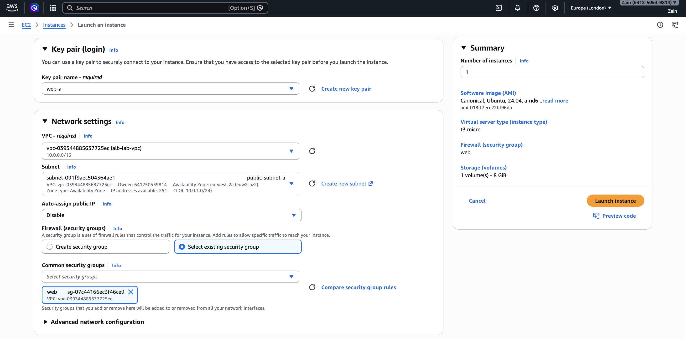

### Launch web-b

Same settings but:

- Name: `web-b`
- Subnet: `public-subnet-b`
- User data: Instance B script

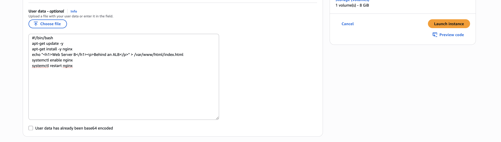

> **Important:** Auto-assign public IP is set to **Disable** for both instances — they should not be directly reachable from the internet.

---

## Step 8 — Register Instances in Target Group

1. EC2 → Target Groups → select `tg-web`
2. Targets tab → **Register targets**
3. Select instances `web-a` and `web-b`
4. Click **Include as pending below** → **Register pending targets**
5. Wait until both show **Healthy**

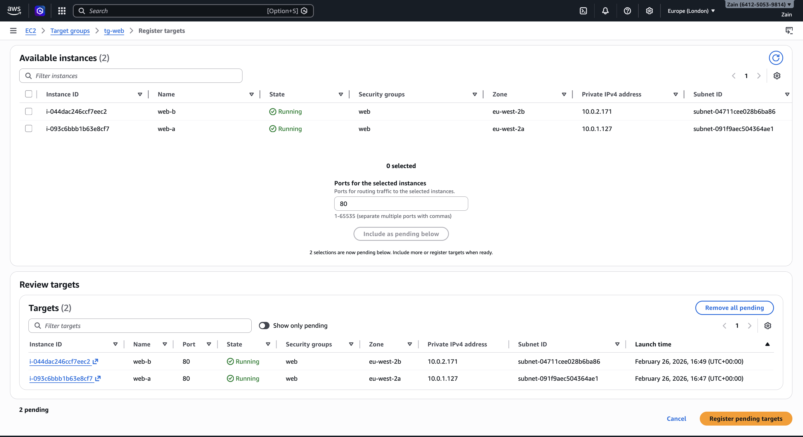

> If targets stay unhealthy, check:
> - `web` SG inbound allows HTTP from `alb` SG
> - NGINX installed correctly (user data)
> - Health check path is `/`

---

## Step 9 — Create the ALB

1. EC2 → Load Balancers → **Create load balancer** → **Application Load Balancer**
2. Name: `alb-lab`
3. Scheme: **Internet-facing**
4. IP address type: **IPv4**
5. VPC: `alb-lab-vpc`
6. Mappings: select **both** subnets (`public-subnet-a` + `public-subnet-b`)
7. Security group: `alb`
8. Listeners: HTTP :80 → Default action: forward to `tg-web`
9. Click **Create load balancer**

---

## Step 10 — Testing (Prove Load Balancing Works)

### Visit the ALB DNS

Open in browser:

```
http://<ALB-DNS-NAME>
```

Refresh multiple times — you should see alternating pages:

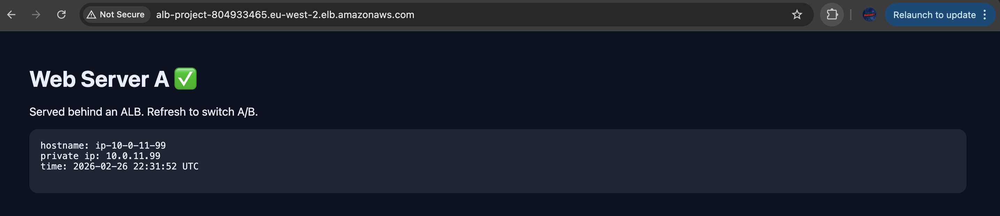

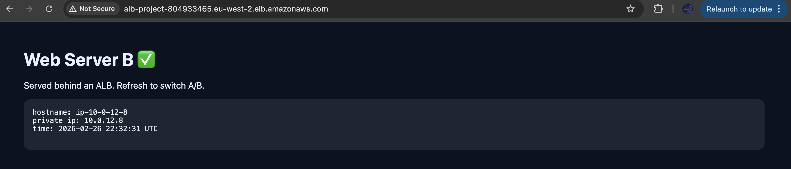

> **Tip:** If it doesn't alternate quickly, open a private/incognito window or refresh with cache disabled.

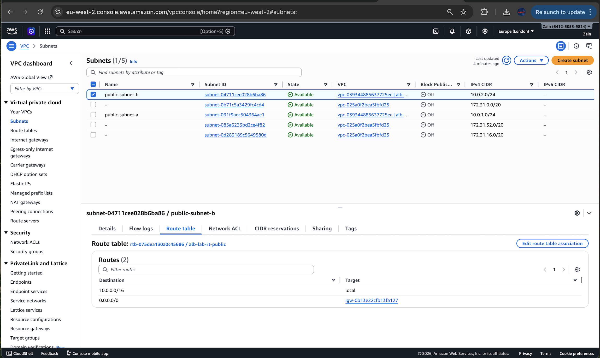


