# Project: REST API with API Gateway → Lambda → DynamoDB (POST /submit + CORS)

## Objective

Build a serverless REST API from scratch:
- DynamoDB table to store submissions
- Lambda function that validates JSON and writes to DynamoDB
- API Gateway (REST API) with `POST /submit` integrated to Lambda (proxy)
- CORS enabled so browsers can call it
- Tested with `curl` and verified in DynamoDB

---

## Step 1 — Create the DynamoDB Table

1. AWS Console → **DynamoDB**
2. Tables → **Create table**
3. Table name: `submissions`
4. Partition key: `submissionID` (String)
5. Capacity mode: **On-demand**
6. Click **Create table**

> **Important:** The partition key must be exactly `submissionID` (capital ID) — this must match the Lambda code.

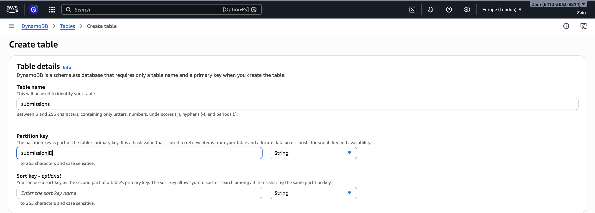

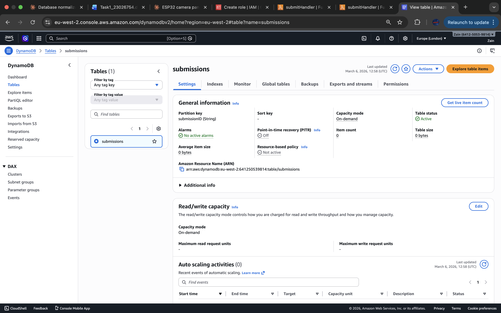

---

## Step 2 — Create the Lambda Execution Role (IAM)

### Create the role

1. AWS Console → **IAM** → Roles → **Create role**
2. Trusted entity: **AWS service** → **Lambda**

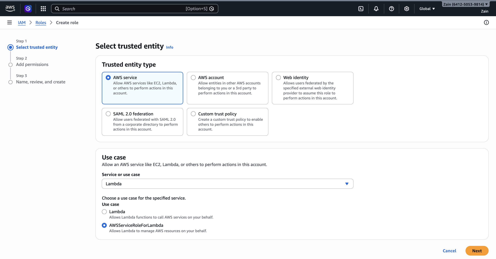

3. Permissions: attach **AWSLambdaExecute**

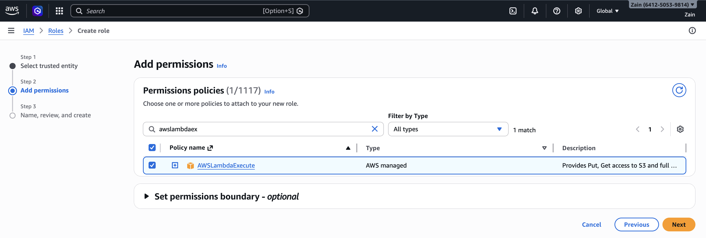

4. Role name: `lambda-dynamodb-submissions-role`
5. Click **Create role**

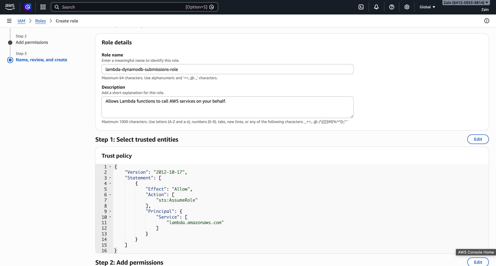

### 2.1 — Add DynamoDB Permission (PutItem)

1. Open the role → Permissions tab
2. **Add permissions** → **Create inline policy**
3. JSON tab, paste:

```json
{
  "Version": "2012-10-17",
  "Statement": [
    {
      "Sid": "AllowWriteToSubmissionsTable",
      "Effect": "Allow",
      "Action": "dynamodb:PutItem",
      "Resource": "arn:aws:dynamodb:eu-west-2:YOUR_ACCOUNT_ID:table/submissions"
    }
  ]
}
```

4. Name it: `AllowWriteToSubmissionsTable`
5. Click **Create policy**

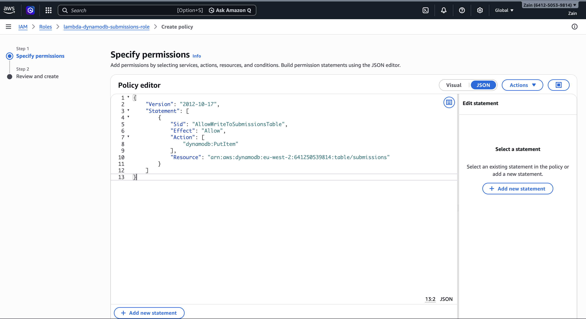

> Do not change the trust relationship — it should remain `lambda.amazonaws.com`.

Final role permissions:

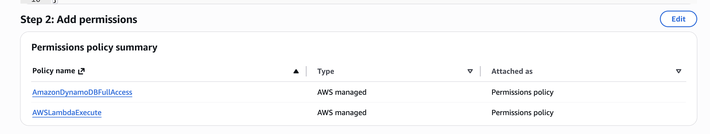

---

## Step 3 — Create the Lambda Function

1. AWS Console → **Lambda** → **Create function**
2. **Author from scratch**
3. Function name: `submitHandler`
4. Runtime: **Node.js**
5. Execution role: **Use existing role** → select `lambda-dynamodb-submissions-role`
6. Click **Create function**

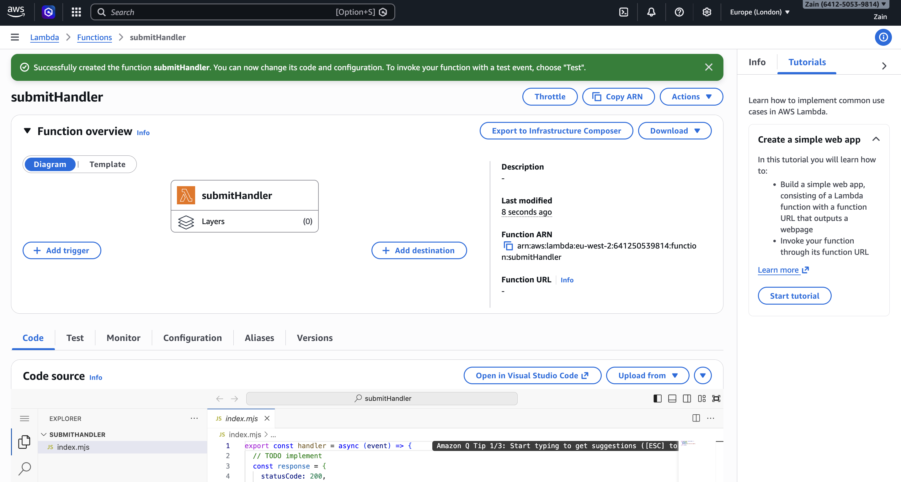

### 3.1 — Verify Execution Role

Lambda → **Configuration** → Permissions tab — confirm the role is attached:

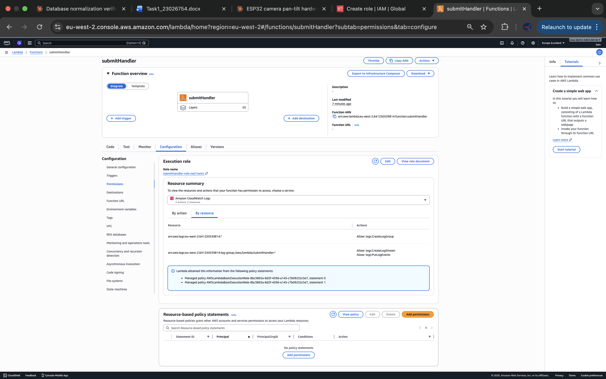

### 3.2 — Add Environment Variable

Lambda → Configuration → **Environment variables**

Add:

| Key | Value |
|---|---|
| `TABLE_NAME` | `submissions` |

Save.

### 3.3 — Paste the Lambda Code and Deploy

Lambda → **Code** tab → paste the following code and click **Deploy**:

```javascript
import { DynamoDBClient } from "@aws-sdk/client-dynamodb";
import { DynamoDBDocumentClient, PutCommand } from "@aws-sdk/lib-dynamodb";
import crypto from "crypto";

const ddb = new DynamoDBClient({});
const docClient = DynamoDBDocumentClient.from(ddb);

const corsHeaders = {
  "Access-Control-Allow-Origin": "*",
  "Access-Control-Allow-Headers": "Content-Type",
  "Access-Control-Allow-Methods": "POST,OPTIONS",
};

export const handler = async (event) => {
  if (event?.httpMethod === "OPTIONS") {
    return { statusCode: 204, headers: corsHeaders, body: "" };
  }

  try {
    let body = {};
    if (event?.body) {
      body = typeof event.body === "string" ? JSON.parse(event.body) : event.body;
    }

    const { name, email, message } = body;

    if (!name || !email || !message) {
      return {
        statusCode: 400,
        headers: corsHeaders,
        body: JSON.stringify({ error: "name, email, and message are required" }),
      };
    }

    const submissionID = crypto.randomUUID();
    const createdAt = new Date().toISOString();

    await docClient.send(
      new PutCommand({
        TableName: process.env.TABLE_NAME,
        Item: { submissionID, createdAt, name, email, message },
      })
    );

    return {
      statusCode: 200,
      headers: corsHeaders,
      body: JSON.stringify({ ok: true, submissionID, createdAt }),
    };
  } catch (err) {
    console.error("Handler error:", err);
    return {
      statusCode: 500,
      headers: corsHeaders,
      body: JSON.stringify({ error: "Internal Server Error" }),
    };
  }
};
```

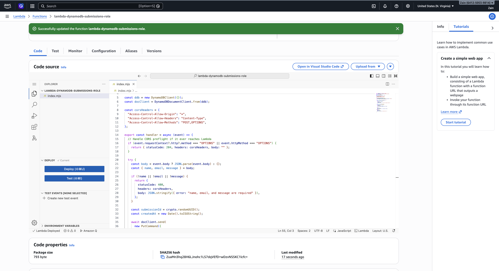

---

## Step 4 — Create the REST API in API Gateway

1. AWS Console → **API Gateway**
2. **Create API** → Choose **REST API** → **Build**
3. API name: `submissions-api`
4. Endpoint type: **Regional**
5. Click **Create API**

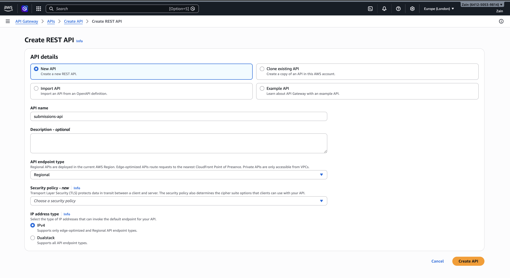

---

## Step 5 — Create /submit Resource + POST Method (Lambda Proxy)

### Create the resource

1. API Gateway → your API → Resources
2. **Create resource**
3. Resource name: `submit`
4. Resource path: `/submit`
5. Click **Create resource**

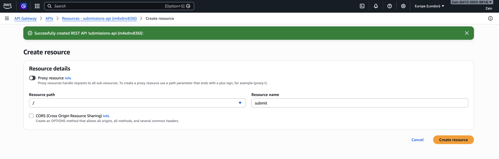

### Create the POST method

1. Select `/submit`
2. **Create method** → Method type: **POST**
3. Integration type: **Lambda Function**
4. Toggle **Lambda proxy integration** ON
5. Lambda function: `submitHandler` (eu-west-2)
6. Click **Create method** and allow permission prompt

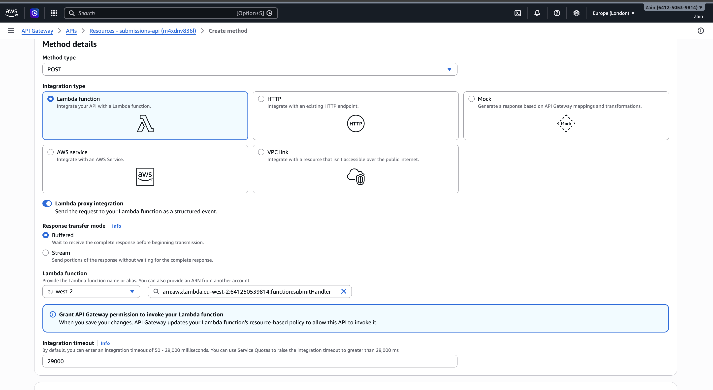

---

## Step 6 — Enable CORS (for Browsers)

1. Select `/submit`
2. **Enable CORS**
3. Access-Control-Allow-Methods: tick **POST** (OPTIONS is included automatically)
4. Access-Control-Allow-Origin: `*`
5. Click **Save**

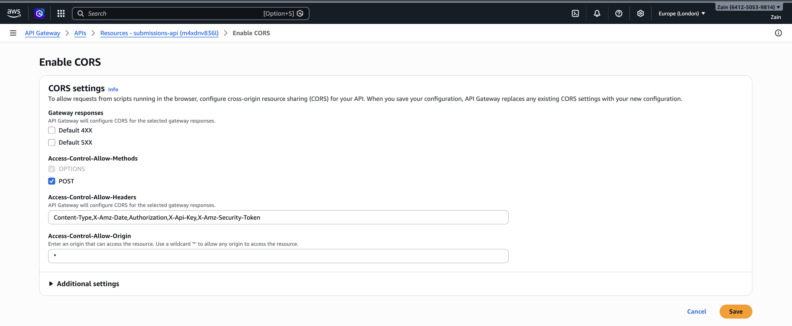

---

## Step 7 — Deploy to a Stage (prod)

1. **Deploy API**
2. Stage: **New stage**
3. Stage name: `prod`
4. Click **Deploy**

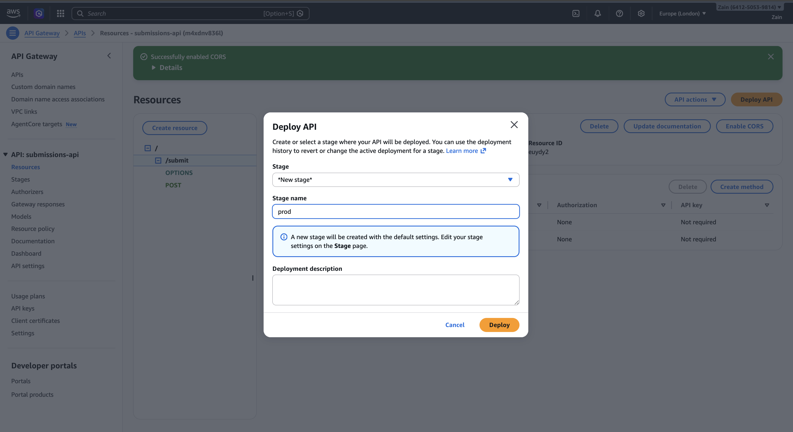

Your invoke URL will be:

```
https://<api-id>.execute-api.eu-west-2.amazonaws.com/prod/submit
```

---

## Step 8 — Test the Endpoint

Test with `curl`:

```bash
curl -i -X POST "https://YOUR_API_ID.execute-api.eu-west-2.amazonaws.com/prod/submit" \
  -H "Content-Type: application/json" \
  -d '{"name":"Zain","email":"zain@zainecs.com","message":"Hello from API Gateway"}'
```

**Result:** HTTP/2 200 with JSON containing `ok: true`, `submissionID`, and `createdAt`

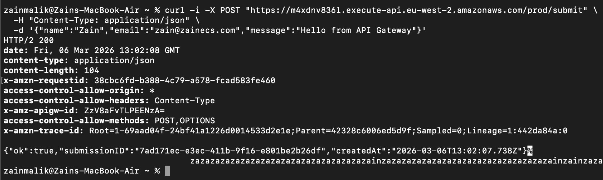

---

## Step 9 — Verify It Saved into DynamoDB

1. DynamoDB → Tables → `submissions`
2. **Explore table items**
3. Click **Run** (Scan)
4. Confirm the item exists with the same `submissionID` from the API response

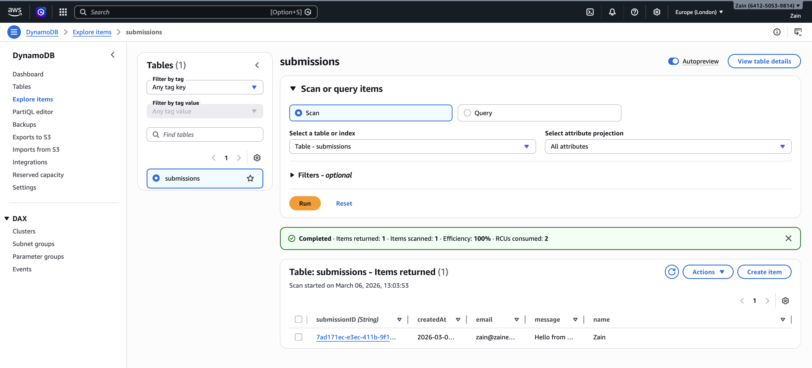

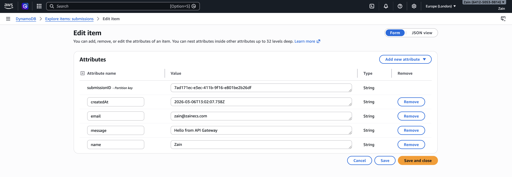