# Project: Custom VPC with Public + Private Subnet, NAT Gateway, and Bastion Host Access

## Objective

Create a custom VPC with:
- 1 public subnet (internet facing)
- 1 private subnet (no public IPs)
- Internet access for public subnet via IGW
- Outbound internet for private subnet via NAT Gateway
- Bastion host in public subnet to SSH into private EC2

---

## Architecture Diagram

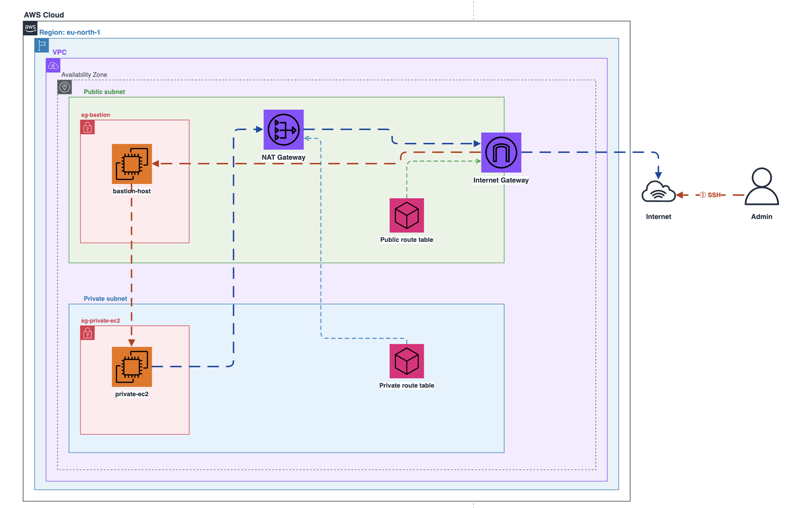

**VPC (10.0.0.0/16)** contains everything, split into two subnets inside a single Availability Zone:

- **Public Subnet (10.0.1.0/24)** — Hosts the `bastion-host` EC2 instance, protected by the `sg-bastion` security group. This subnet has a route to the **Internet Gateway (IGW)**, giving it direct inbound and outbound internet access. The **NAT Gateway** also lives here, providing outbound only internet access for the private subnet.

- **Private Subnet (10.0.2.0/24)** — Hosts the `private-ec2` instance, protected by the `sg-private-ec2` security group. This subnet has no direct internet access. Its **Private Route Table** routes outbound traffic (`0.0.0.0/0`) through the **NAT Gateway** in the public subnet, which then forwards it out via the IGW.

**Traffic flow:**

1. **Admin → Bastion (SSH):** The admin connects from the internet via SSH to the bastion host's public IP. The `sg-bastion` security group only allows SSH (port 22) from the admin's IP.
2. **Bastion → Private EC2 (SSH):** From the bastion, the admin SSH-hops into the private EC2 using its private IP. The `sg-private-ec2` security group only allows SSH from the `sg-bastion` security group — no other source can reach it.
3. **Private EC2 → Internet (outbound only):** When the private EC2 needs to reach the internet (e.g. `apt update`, `curl`), traffic goes: Private EC2 → Private Route Table → NAT Gateway → IGW → Internet. Return traffic comes back the same path. **No inbound** traffic from the internet can reach the private EC2 directly.

This architecture follows AWS best practices: sensitive workloads stay in private subnets with no public exposure, while a bastion host acts as a controlled entry point for admin access.

---

## Step 1 — Create a Custom VPC

1. AWS Console → **VPC**
2. Your VPCs → **Create VPC**
3. Choose **VPC only**
4. Name: `vpc-lab`
5. IPv4 CIDR: `10.0.0.0/16`
6. Click **Create VPC**

**Result:** VPC created with CIDR `10.0.0.0/16`

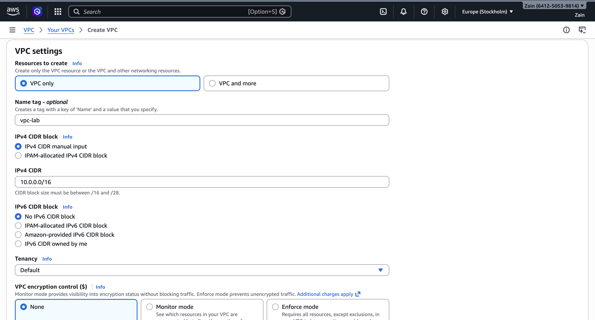

---

## Step 2 — Create 1 Public Subnet and 1 Private Subnet

VPC → Subnets → **Create subnet**

### Public Subnet

- VPC: `vpc-lab`
- Subnet name: `public-subnet-1a`
- AZ: `eu-north-1a`
- CIDR: `10.0.1.0/24`

### Private Subnet

- VPC: `vpc-lab`
- Subnet name: `private-subnet-1a`
- AZ: `eu-north-1a`
- CIDR: `10.0.2.0/24`

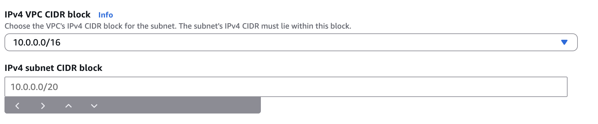

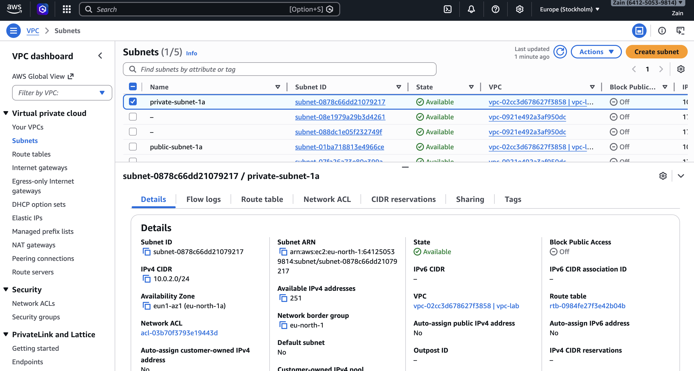

---

## Step 3 — Create and Attach an Internet Gateway (IGW)

1. VPC → Internet Gateways → **Create internet gateway**
2. Name: `igw-lab`
3. Click **Create**
4. Select IGW → Actions → **Attach to VPC**
5. Attach to `vpc-lab`

**Result:** VPC has an Internet Gateway attached

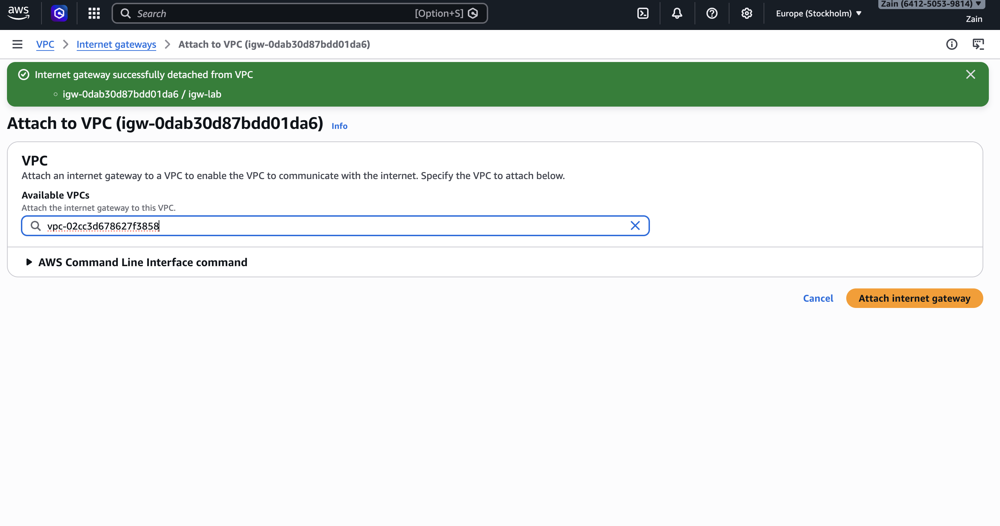

---

## Step 4 — Create a Public Route Table and Associate It to the Public Subnet

### Create the route table

1. VPC → Route tables → **Create route table**
2. Name: `rt-public`
3. VPC: `vpc-lab`
4. Click **Create**

### Add public route to Internet

1. Select `rt-public`
2. Routes → **Edit routes** → **Add route**
3. Destination: `0.0.0.0/0`
4. Target: `igw-lab`
5. Click **Save**

### Associate with public subnet

1. `rt-public` → Subnet associations → **Edit**
2. Select `public-subnet-1a`
3. Click **Save**

**Result:** Public subnet has internet routing via IGW

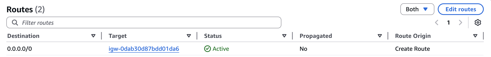

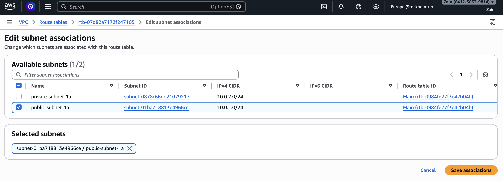

---

## Step 5 — Create a NAT Gateway in the Public Subnet (for Private Outbound Internet)

1. VPC → NAT gateways → **Create NAT gateway**
2. Name: `nat-gateway-01`
3. Subnet: `public-subnet-1a`
4. Click **Allocate Elastic IP**
5. Click **Create NAT Gateway**
6. Wait for status: **Available**

**Result:** NAT Gateway exists in the public subnet with an Elastic IP

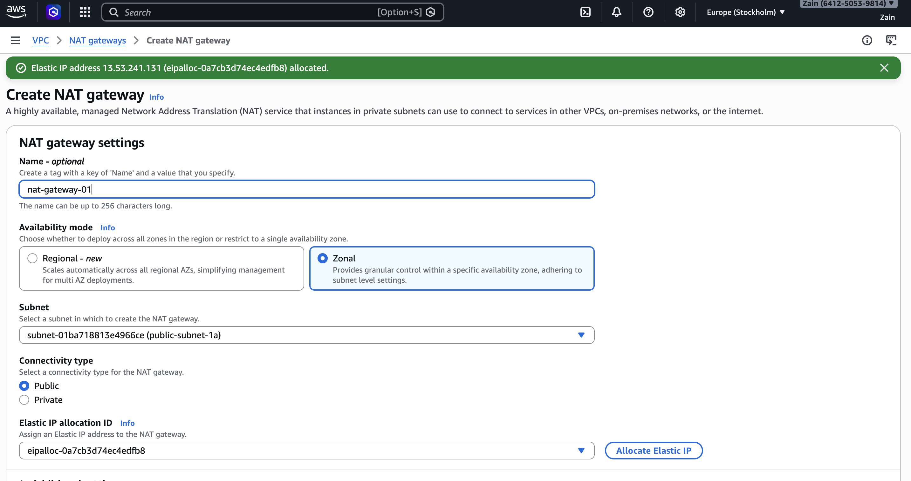

---

## Step 6 — Create a Private Route Table and Associate It to the Private Subnet

### Create the route table

1. VPC → Route tables → **Create route table**
2. Name: `rt-private`
3. VPC: `vpc-lab`
4. Click **Create**

### Add route to NAT Gateway

1. Select `rt-private`
2. Routes → **Edit routes** → **Add route**
3. Destination: `0.0.0.0/0`
4. Target: NAT Gateway (`nat-0110df809ca58e03b`)
5. Click **Save**

### Associate with private subnet

1. VPC → Subnets → Select `private-subnet-1a`
2. Actions → **Edit route table association**
3. Choose `rt-private`
4. Click **Save**

**Result:** Private subnet can reach the internet outbound via NAT, but stays private (no inbound from internet)

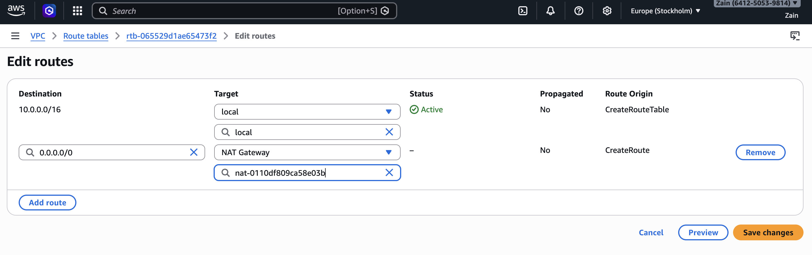

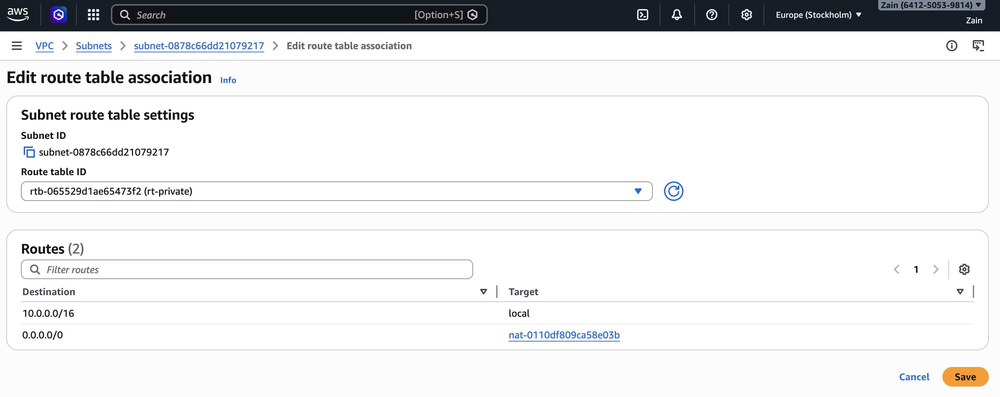

---

## Step 7 — Create Security Groups

Two security groups created inside `vpc-lab`.

### Security Group 1: Bastion SG

1. EC2 → Security Groups → **Create security group**
2. Name: `bastion`
3. Description: `bastion sg`
4. VPC: `vpc-lab`
5. **Outbound:** All traffic + SSH from My IP
6. Click **Create**

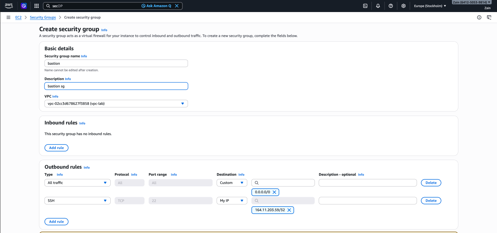

### Add Inbound Rule to Bastion SG

1. Select `bastion` SG → **Edit inbound rules**
2. Add rule: SSH (22) from **My IP** (`164.11.203.59/32`)
3. Click **Save rules**

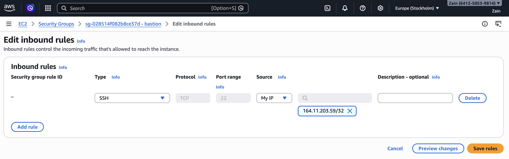

### Security Group 2: Private EC2 SG

1. Create another SG: `private-ec2`
2. VPC: `vpc-lab`
3. **Inbound:** SSH (22) source = `bastion` security group (security group reference)
4. **Outbound:** Allow all traffic

> This ensures only the bastion host can SSH into the private EC2 instance.

---

## Step 8 — Launch the Bastion Host EC2 in the Public Subnet

1. EC2 → **Launch instance**
2. Name: `bastion-host`
3. AMI: **Ubuntu**
4. VPC: `vpc-lab`
5. Subnet: `public-subnet-1a`
6. Auto-assign public IP: **Enable**
7. Security group: `bastion`
8. Key pair: `vpc-lab.pem`

**Result:** Bastion host has a public IPv4 address

---

## Step 9 — Launch the Private EC2 in the Private Subnet

1. EC2 → **Launch instance**
2. Name: `private-ec2`
3. AMI: **Ubuntu**
4. VPC: `vpc-lab`
5. Subnet: `private-subnet-1a`
6. Auto-assign public IP: **Disable**
7. Security group: `private-ec2`
8. Key pair: same `vpc-lab.pem`

**Result:** Private EC2 has only a private IP (no public IP)

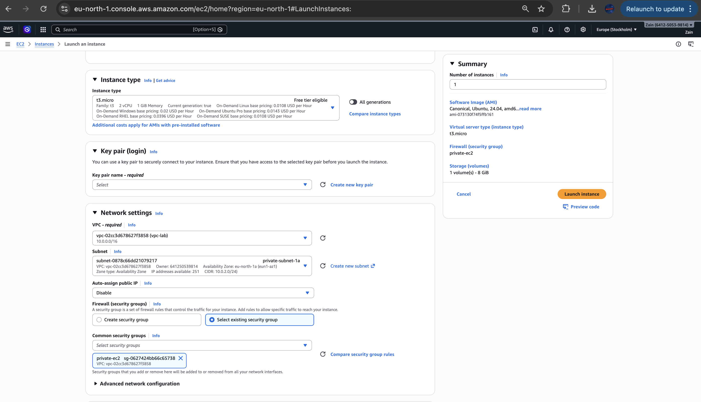

---

## Step 10 — SSH into Bastion, then into Private EC2

### Fix key permissions (required)

```bash
chmod 400 /users/zainmalik/vpc-lab.pem
```

### Start SSH agent + add key

```bash
eval "$(ssh-agent -s)"
ssh-add /users/zainmalik/vpc-lab.pem
```

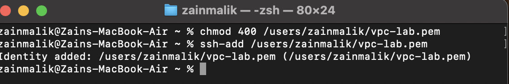

### SSH into the bastion (with agent forwarding)

```bash
ssh -A ubuntu@<BASTION_PUBLIC_IP>
```

### From bastion, SSH into private EC2

```bash
ssh ubuntu@<PRIVATE_EC2_PRIVATE_IP>
```

**Result:** You can access the private server only through the bastion host

---

## Step 11 — Prove Private Subnet Has Outbound Internet (NAT Works)

On the private EC2 instance, run:

```bash
curl -I https://www.google.com
```

**Result:** HTTP/2 200 response received, proving private subnet outbound internet works via NAT Gateway

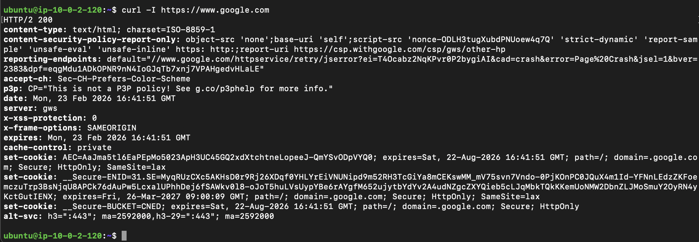