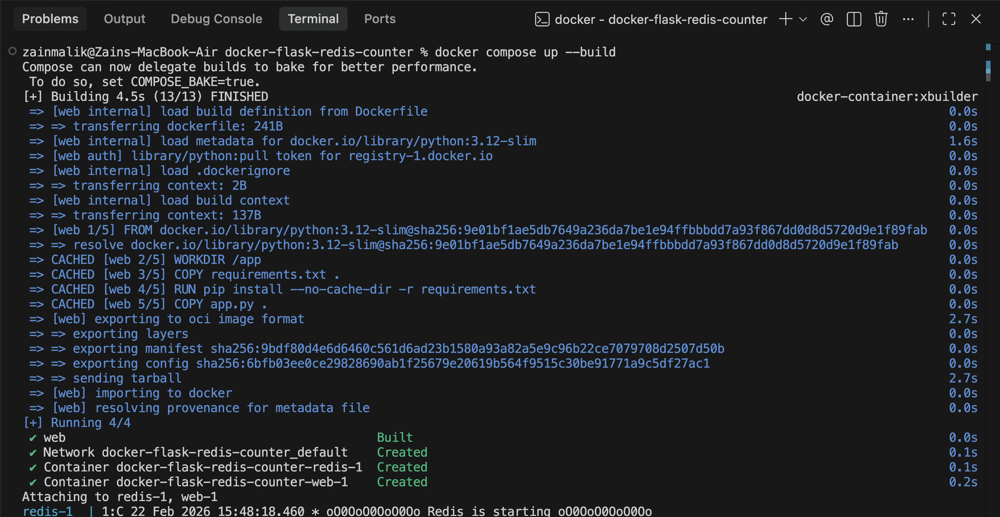
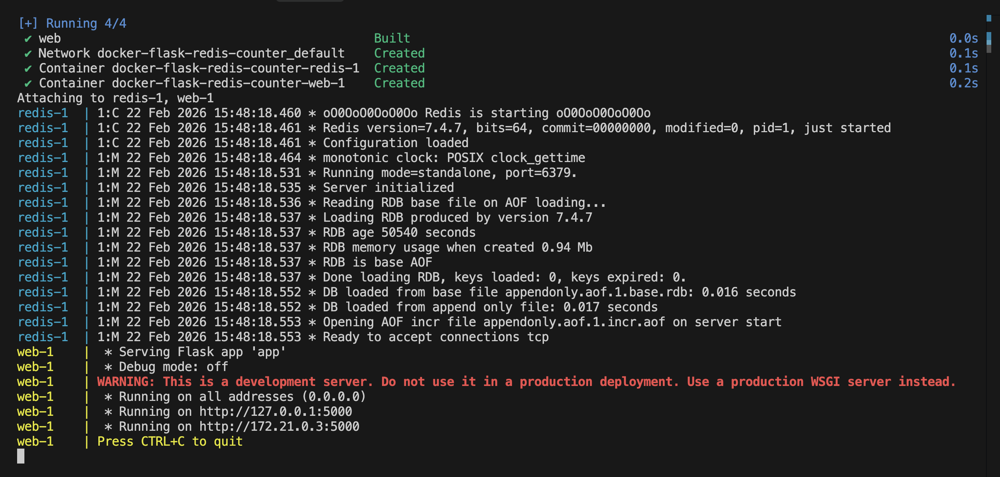
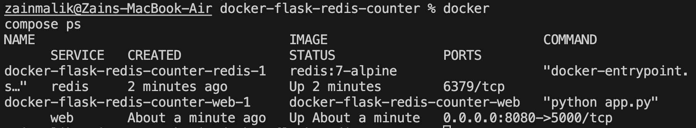
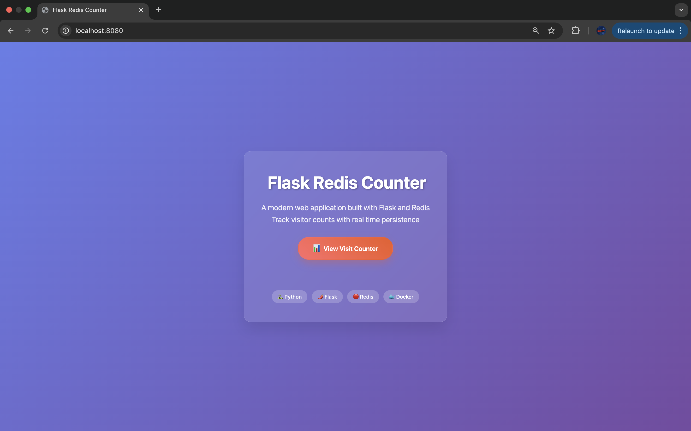
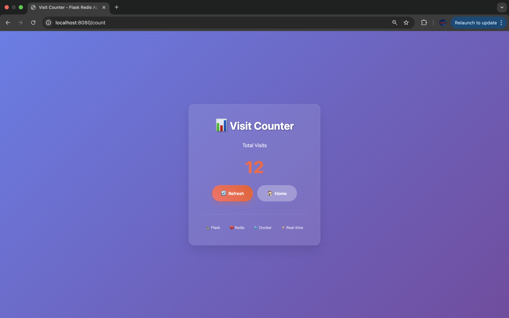

# Mini Project: Docker Flask Redis Counter

## Overview

This mini project demonstrates how to build and run a multi-container application using Docker Compose. A Flask web app connects to a Redis backend to track and persist page visit counts.

### Learning Objectives

The goal was to understand:
- How to containerise a Python Flask application with Docker
- How to orchestrate multiple containers using Docker Compose
- How inter-container networking works via service names
- How Docker volumes provide data persistence across container restarts

## What I Built

- A Flask web app with a home page and a visit counter page
- A Redis container for storing the visit count
- A `docker-compose.yml` to orchestrate both services
- Redis persistence using a named volume with append-only file (AOF)

## Project Structure

```
docker-flask-redis-counter/
├── app/
│   ├── app.py              # Flask application
│   ├── requirements.txt    # Python dependencies
│   └── Dockerfile          # Container definition for Flask
├── docker-compose.yml       # Multi-container orchestration
├── screenshots/             # Project screenshots
└── README.md
```

## Step-by-Step Process

### 1) Build the Flask App

Created `app/app.py` with two routes:
- `/` — Welcome/home page
- `/count` — Increments and displays the Redis-backed visit counter

```python
import os
from flask import Flask
import redis

app = Flask(__name__)

REDIS_HOST = os.getenv("REDIS_HOST", "redis")
REDIS_PORT = int(os.getenv("REDIS_PORT", "6379"))
REDIS_KEY = os.getenv("REDIS_KEY", "visits")

r = redis.Redis(host=REDIS_HOST, port=REDIS_PORT, decode_responses=True)

@app.route("/")
def home():
    return "Welcome! Go to /count to increment the visit counter."

@app.route("/count")
def count():
    visits = r.incr(REDIS_KEY)
    return f"Visit count: {visits}"

if __name__ == "__main__":
    app.run(host="0.0.0.0", port=5000, debug=False)
```

Created `app/requirements.txt` with the dependencies:

```
flask==3.0.0
redis==5.0.1
```

### 2) Dockerise the Flask App

Created `app/Dockerfile`:

```dockerfile
FROM python:3.12-slim

WORKDIR /app

COPY requirements.txt .
RUN pip install --no-cache-dir -r requirements.txt

COPY app.py .

EXPOSE 5000

CMD ["python", "app.py"]
```

### 3) Create Docker Compose (Flask + Redis)

Created `docker-compose.yml` in the project root:

```yaml
services:
  web:
    build: ./app
    ports:
      - "8080:5000"
    environment:
      REDIS_HOST: redis
      REDIS_PORT: 6379
      REDIS_KEY: visits
    depends_on:
      - redis

  redis:
    image: redis:7-alpine
    volumes:
      - redis_data:/data
    command: ["redis-server", "--appendonly", "yes"]

volumes:
  redis_data:
```

**What this achieves:**
- Flask runs in one container, Redis in another
- Flask connects to Redis using the service name `redis`
- Redis data persists using a named volume (`redis_data`)
- `depends_on` ensures Redis starts before the Flask app

### 4) Run the Multi-Container App

From the project root:

```bash
docker compose up --build
```



Both containers start successfully — Redis initialises and Flask begins serving:



Verified both services are running with `docker compose ps`:



### 5) Test the App in the Browser

#### 5.1 Welcome Page

Opened `http://localhost:8080/` in the browser:



#### 5.2 Counter Page

Opened `http://localhost:8080/count` and refreshed multiple times — the count increments with each visit:



### 6) Redis Persistence (Volume Proof)

This proves the Redis volume works and data survives container restarts.

1. Hit `/count` until reaching a number (e.g. 12)
2. Stop the containers:
   ```bash
   docker compose down
   ```
3. Start again:
   ```bash
   docker compose up
   ```
4. Visit `/count` again — the counter continues from where it left off, it does not reset

### 7) Cleanup

To stop containers:

```bash
docker compose down
```

To stop containers **and** delete the Redis volume (wipes the stored count):

```bash
docker compose down -v
```

## Environment Variables

| Variable | Default | Description |
|----------|---------|-------------|
| `REDIS_HOST` | `redis` | Redis server hostname (Docker service name) |
| `REDIS_PORT` | `6379` | Redis server port |
| `REDIS_KEY` | `visits` | Redis key used for the counter |

## Useful Commands

```bash
# Build and start
docker compose up --build

# Start in background
docker compose up -d

# Check running containers
docker compose ps

# View logs
docker compose logs web
docker compose logs redis

# Stop containers
docker compose down

# Stop and remove volumes
docker compose down -v
```
