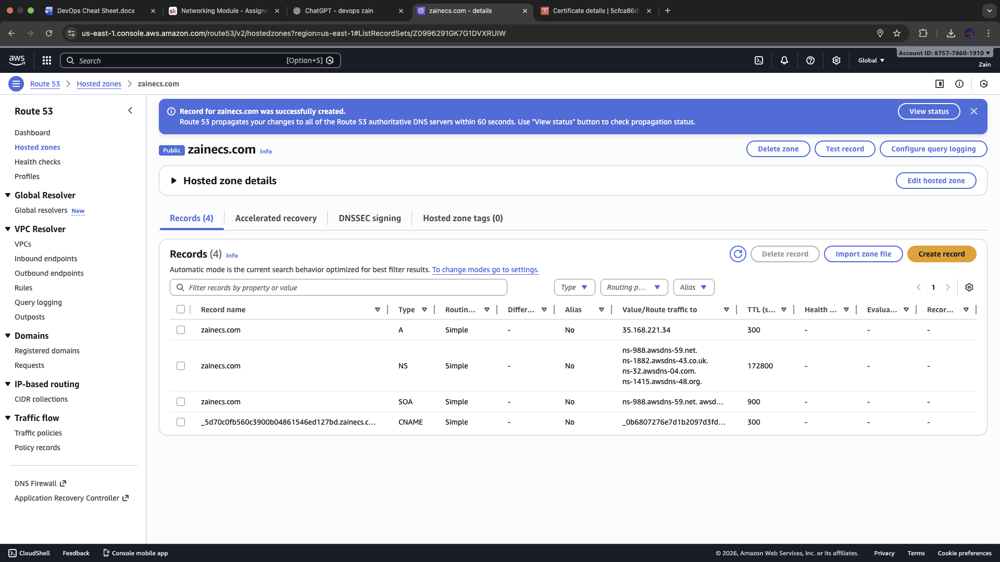

# Mini Project: Host NGINX on EC2 with Custom Domain (Route 53)

## Overview

This mini project demonstrates how to deploy a basic web server on AWS using EC2 (Ubuntu), install NGINX, and make the default NGINX page load using a custom domain purchased/managed in Route 53.

### Learning Objectives

The goal was to understand:
- How public DNS maps a domain to a server IP
- How to deploy and verify a web server on EC2
- How Elastic IP stabilises the public IP address for DNS pointing
- How to validate setup using browser + CLI tools

## Architecture

```
User Browser → Route 53 (DNS) → Elastic IP → EC2 (Ubuntu) → NGINX
```

## What I Built

- Registered / managed domain in Route 53
- Created a public hosted zone and DNS records
- Launched an Ubuntu EC2 instance
- Installed and started NGINX
- Allocated and associated an Elastic IP to keep a consistent public IPv4
- Created an A record so the domain points to the EC2 public IP (Elastic IP)
- Verified the site loads using both browser and CLI tools

## Step-by-Step Process

### 1) Launch EC2 (Ubuntu) + Open Port 80

Created an EC2 instance using Ubuntu.

**Security Group Inbound Rules:**
- **SSH (22)** from my IP
- **HTTP (80)** from anywhere (0.0.0.0/0)


### 2) Allocate and Associate an Elastic IP

Allocated an Elastic IP and associated it with the EC2 instance.

**Why Elastic IP is important:**
- EC2 public IPs can change after stop/start
- Elastic IP stays consistent for DNS pointing


### 3) SSH into Server and Install NGINX

After connecting via SSH, installed and started NGINX:

```bash
sudo apt update
sudo apt install nginx -y
sudo systemctl enable --now nginx
```


### 4) Verify NGINX Locally on Instance

Confirmed the web server was responding internally using `curl`:


### 5) Verify NGINX Loads via Public IP

Tested in browser using the Elastic IP/public IPv4 address.


### 6) Configure Route 53 DNS (A Record)

In the hosted zone for the domain, created an A record pointing the root domain to the Elastic IP.

**DNS Record Configuration:**
- **Record type:** A
- **Record name:** left blank (root/apex)
- **Value:** Elastic IP
- **TTL:** 300 seconds


### 7) Validate DNS Resolution

Tested from local machine using `nslookup` to confirm DNS was returning the correct result.


### 8) Confirm Domain Loads NGINX Page

Opened the domain in browser and confirmed the default NGINX page loaded successfully.


### (Optional/Attempted) ACM DNS Validation

Explored requesting a public certificate in ACM using DNS validation, which required adding a CNAME validation record in Route 53.



**Note:** Decided not to continue with HTTPS via ALB for this mini project, but kept these screenshots as evidence of learning around certificate validation and DNS records.

## Cleanup (Prevent AWS Costs)

After completing the project, cleaned up AWS resources to avoid ongoing charges:
- Terminated EC2 instance
- Released any unused Elastic IPs
- (Optional) Removed A/CNAME records if no longer needed
- Disabled domain auto-renew if not keeping the domain long-term

## Key Takeaways

### Core Concepts Learned
1. **DNS in Route 53** can map a domain directly to an Elastic IP using an A record
2. **Elastic IP** keeps a stable public IPv4 address for consistent DNS pointing
3. **NGINX validation** can be performed at multiple levels:
   - Locally (`curl http://localhost`)
   - Publicly via IP
   - Publicly via domain
4. **Hosted zone records** (A, NS, SOA) are core building blocks in DNS management

### Technical Skills Demonstrated
- EC2 instance deployment and security group configuration
- Elastic IP allocation and association
- Linux server administration (NGINX installation)
- Route 53 DNS record management
- DNS troubleshooting and validation
- Web server testing methodologies

## Screenshot Analysis

| Screenshot | What It Shows | Evidence Provided |
|-------------|----------------|-------------------|
| `01-ec2-instance-security-group.png` | EC2 instance launch with security group rules | Server deployment with proper network access |
| `02-elastic-ip-association.png` | Elastic IP allocation and association | Stable IP configuration for DNS |
| `03-nginx-service-running.png` | NGINX service status after installation | Web server software successfully installed |
| `04-curl-localhost-test.png` | Local curl test against localhost | Internal server functionality verification |
| `05-nginx-via-public-ip.png` | Browser access via public IP | Public internet connectivity confirmed |
| `06-route53-a-record-creation.png` | Route 53 A record creation process | DNS configuration workflow |
| `07-hosted-zone-records.png` | Hosted zone showing configured records | DNS records properly stored |
| `08-dns-resolution-nslookup.png` | nslookup command output | DNS resolution working correctly |
| `09-nginx-via-custom-domain.png` | Browser loading domain successfully | End-to-end functionality confirmed |
| `10-acm-certificate-request.png` | ACM certificate request interface | SSL certificate workflow understanding |
| `11-final-success-confirmation.png` | Final project success confirmation | Complete working setup |

## Next Improvements

If extending this project later:

1. **Add HTTPS** with an ALB (443 listener) and ACM certificate
2. **Add www record** and redirect to apex domain
3. **Replace default NGINX page** with a custom landing page
4. **Use Terraform** to provision EC2 + Route 53 automatically
5. **Implement monitoring** with CloudWatch alerts
6. **Add backup strategy** for the web server content

## Commands Used

### EC2 & Security
```bash
# Launch EC2 instance (via AWS Console)
# Configure security group rules
```

### Server Setup
```bash
# Update system
sudo apt update

# Install NGINX
sudo apt install nginx -y

# Enable and start NGINX
sudo systemctl enable --now nginx

# Check NGINX status
sudo systemctl status nginx

# Test locally
curl http://localhost
```

### DNS Validation
```bash
# Test DNS resolution
nslookup your-domain.com

# Test HTTP response
curl http://your-domain.com
```

## Troubleshooting Tips

### Common Issues & Solutions

1. **NGINX not accessible**
   - Check security group allows port 80
   - Verify NGINX is running: `sudo systemctl status nginx`
   - Check AWS Network ACLs

2. **Domain not resolving**
   - Verify A record points to correct Elastic IP
   - Check DNS propagation: `nslookup your-domain.com`
   - Confirm domain registration is active

3. **SSH connection issues**
   - Verify security group allows port 22 from your IP
   - Check that instance is running
   - Use correct key pair

## Project Structure

```
networking/projects/
├── Host NGINX on EC2 with a Custom Domain.md    # This file
└── screenshots/                                   # All project screenshots
    ├── 01-ec2-instance-security-group.png
    ├── 02-elastic-ip-association.png
    ├── 03-nginx-service-running.png
    ├── 04-curl-localhost-test.png
    ├── 05-nginx-via-public-ip.png
    ├── 06-route53-a-record-creation.png
    ├── 07-hosted-zone-records.png
    ├── 08-dns-resolution-nslookup.png
    ├── 09-nginx-via-custom-domain.png
    ├── 10-acm-certificate-request.png
    └── 11-final-success-confirmation.png
```

---

**Project Status:** ✅ Complete  
**Last Updated:** January 2026  
**AWS Services Used:** EC2, Route 53, (Optional: ACM)  
**Screenshots:** 11 images documenting complete workflow