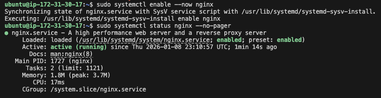
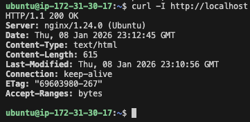
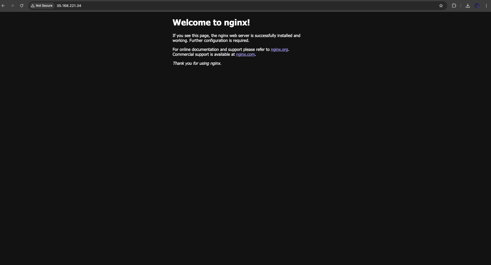
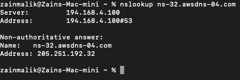
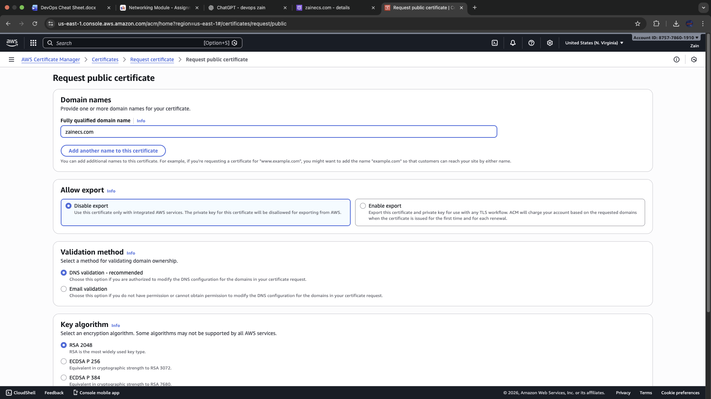
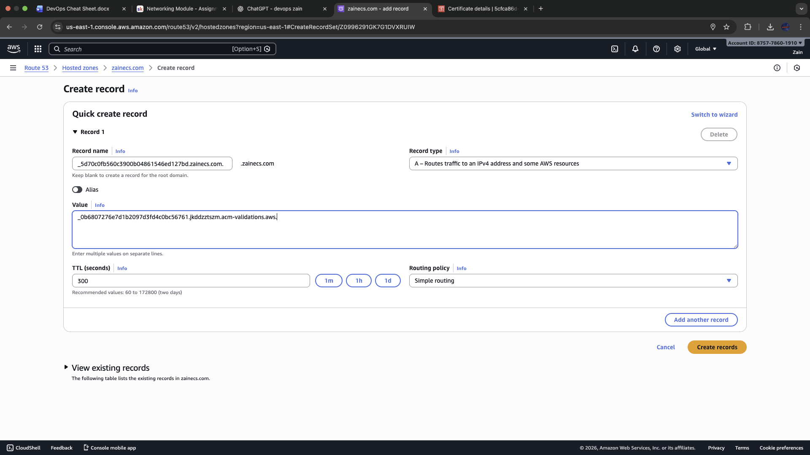
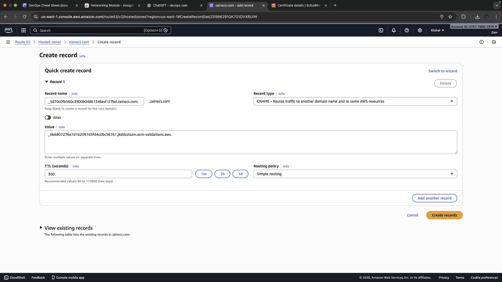

# Mini Project: Host NGINX on EC2 with Custom Domain (Route 53)

## Overview

This mini project demonstrates how to deploy a basic web server on AWS using EC2 (Ubuntu), install NGINX, and make the default NGINX page load using a custom domain purchased/managed in Route 53.

### Learning Objectives

The goal was to understand:
- How public DNS maps a domain to a server IP
- How to deploy and verify a web server on EC2
- How Elastic IP stabilises the public IP address for DNS pointing
- How to validate setup using browser + CLI tools

## What I Built

- Registered / managed domain in Route 53
- Created a public hosted zone and DNS records
- Launched an Ubuntu EC2 instance
- Installed and started NGINX
- Allocated and associated an Elastic IP to keep a consistent public IPv4
- Created an A record so the domain points to the EC2 public IP (Elastic IP)
- Verified the site loads using both browser and CLI tools

## Step-by-Step Process

### 1) Launch EC2 (Ubuntu) + Open Port 80

Created an EC2 instance using Ubuntu.

**Security Group Inbound Rules:**
- **SSH (22)** from my IP
- **HTTP (80)** from anywhere (0.0.0.0/0)



### 2) Allocate and Associate an Elastic IP

Allocated an Elastic IP and associated it with the EC2 instance.

**Why Elastic IP is important:**
- EC2 public IPs can change after stop/start
- Elastic IP stays consistent for DNS pointing



### 3) SSH into Server and Install NGINX

After connecting via SSH, installed and started NGINX:

```bash
sudo apt update
sudo apt install nginx -y
sudo systemctl enable --now nginx
```


### 4) Verify NGINX Locally on Instance

Confirmed the web server was responding internally using `curl`:


### 5) Verify NGINX Loads via Public IP

Tested in browser using the Elastic IP/public IPv4 address.



### 6) Configure Route 53 DNS (A Record)

In the hosted zone for the domain, created an A record pointing the root domain to the Elastic IP.

**DNS Record Configuration:**
- **Record type:** A
- **Record name:** left blank (root/apex)
- **Value:** Elastic IP
- **TTL:** 300 seconds





### 7) Validate DNS Resolution

Tested from local machine using `nslookup` to confirm DNS was returning the correct result.



### 8) Confirm Domain Loads NGINX Page

Opened the domain in browser and confirmed the default NGINX page loaded successfully.



## Cleanup (Prevent AWS Costs)
After completing the project, cleaned up AWS resources to avoid ongoing charges:
- Terminated EC2 instance
- Released any unused Elastic IPs
- (Optional) Removed A/CNAME records if no longer needed
- Disabled domain auto-renew if not keeping the domain long-term

### Server Setup
```bash
# Install NGINX
sudo apt install nginx -y

# Enable and start NGINX
sudo systemctl enable --now nginx

# Check NGINX status
sudo systemctl status nginx

# Test locally
curl http://localhost
```

### DNS Validation
```bash
# Test DNS resolution
nslookup your-domain.com

# Test HTTP response
curl http://your-domain.com
```
