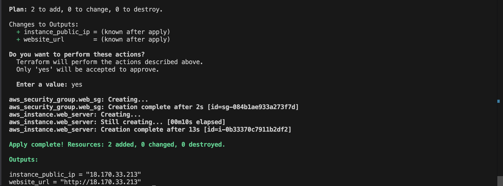
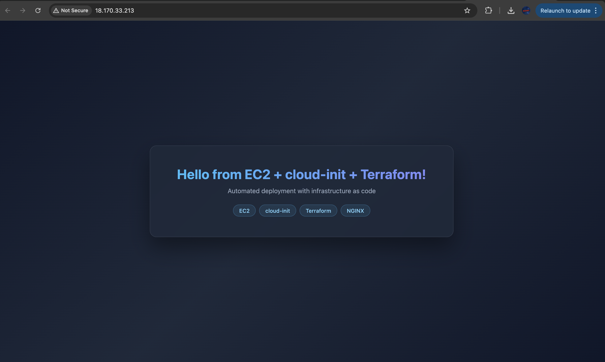
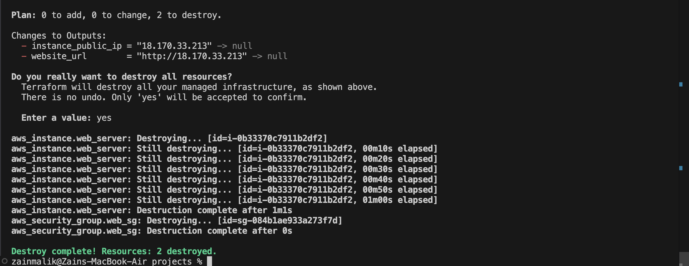

# Project: EC2 Deployment with Terraform + Cloud-Init (NGINX)

## Objective

Automate EC2 instance deployment using Terraform and cloud-init:
- Configure a cloud-init YAML file to install and set up NGINX on boot
- Use Terraform to provision an EC2 instance, security group, and pass the cloud-init config
- Keep sensitive values out of source control using `terraform.tfvars` (gitignored)
- Verify the web server is live by visiting the public IP

---

## File Structure

```
terraform/projects/
├── main.tf                    # EC2, security group, outputs
├── variables.tf               # Variable declarations (no secrets)
├── cloud-init.yaml            # Boot-time software setup
├── terraform.tfvars           # Values (gitignored)
├── screenshots/               # Project screenshots
└── Cloud-init Automation with Terraform and NGINX.md
```

---

## Step 1 — Prerequisites

Make sure you have Terraform and AWS CLI installed and configured:

```bash
# Install Terraform
brew install terraform

# Install AWS CLI
pip install awscli

# Configure AWS credentials
aws configure
# → Enter: Access Key ID, Secret Access Key, Region (e.g. eu-west-2), output format (json)
```

---

## Step 2 — Write the cloud-init.yaml File

This runs automatically on first boot to install and configure NGINX.

```yaml
#cloud-config

# Update package lists and upgrade existing packages
package_update: true
package_upgrade: true

# Packages to install
packages:
  - nginx
  - curl
  - git

# Write custom files to the instance
write_files:
  - path: /var/www/html/index.html
    permissions: '0644'
    content: |
      <!DOCTYPE html>
      <html lang="en">
        <head>
          <meta charset="UTF-8">
          <meta name="viewport" content="width=device-width, initial-scale=1.0">
          <title>My EC2 Server</title>
          <style>
            * { margin: 0; padding: 0; box-sizing: border-box; }
            body {
              min-height: 100vh;
              display: flex;
              align-items: center;
              justify-content: center;
              background: linear-gradient(135deg, #0f172a 0%, #1e293b 50%, #0f172a 100%);
              font-family: -apple-system, BlinkMacSystemFont, 'Segoe UI', Roboto, sans-serif;
              color: #e2e8f0;
            }
            .card {
              text-align: center;
              padding: 3rem 4rem;
              background: rgba(30, 41, 59, 0.8);
              border: 1px solid rgba(148, 163, 184, 0.15);
              border-radius: 1rem;
              backdrop-filter: blur(10px);
              box-shadow: 0 25px 50px rgba(0, 0, 0, 0.4);
            }
            h1 {
              font-size: 2rem;
              font-weight: 700;
              margin-bottom: 0.75rem;
              background: linear-gradient(to right, #38bdf8, #818cf8);
              -webkit-background-clip: text;
              -webkit-text-fill-color: transparent;
            }
            .tags {
              display: flex;
              gap: 0.5rem;
              justify-content: center;
              margin-top: 1.5rem;
            }
            .tag {
              padding: 0.35rem 0.85rem;
              border-radius: 9999px;
              font-size: 0.8rem;
              font-weight: 500;
              background: rgba(56, 189, 248, 0.1);
              border: 1px solid rgba(56, 189, 248, 0.25);
              color: #7dd3fc;
            }
            .subtitle {
              color: #94a3b8;
              font-size: 0.95rem;
            }
          </style>
        </head>
        <body>
          <div class="card">
            <h1>Hello from EC2 + cloud-init + Terraform!</h1>
            <p class="subtitle">Automated deployment with infrastructure as code</p>
            <div class="tags">
              <span class="tag">EC2</span>
              <span class="tag">cloud-init</span>
              <span class="tag">Terraform</span>
              <span class="tag">NGINX</span>
            </div>
          </div>
        </body>
      </html>

  - path: /etc/nginx/sites-available/default
    permissions: '0644'
    content: |
      server {
        listen 80 default_server;
        listen [::]:80 default_server;

        root /var/www/html;
        index index.html;

        server_name _;

        location / {
          try_files $uri $uri/ =404;
        }
      }

# Commands to run after packages are installed
runcmd:
  - systemctl enable nginx
  - systemctl start nginx
  - systemctl reload nginx
  - echo "cloud-init complete" >> /var/log/cloud-init-done.log
```

**Key sections:**
- **`packages`** — installs NGINX, curl, git at boot
- **`write_files`** — creates the HTML page and NGINX server config
- **`runcmd`** — enables and starts NGINX as a service
- **`#cloud-config`** — this header is **required** — AWS uses it to identify the file format

---

## Step 3 — Write variables.tf

Variables are declared here **without defaults for sensitive values** — actual values go in `terraform.tfvars` (gitignored).

```hcl
variable "aws_region" {
  description = "AWS region to deploy into"
  type        = string
}

variable "instance_type" {
  description = "EC2 instance type"
  type        = string
  default     = "t2.micro"
}

variable "ami_id" {
  description = "Ubuntu 22.04 AMI ID (region-specific)"
  type        = string
}

variable "key_name" {
  description = "Name of your existing EC2 key pair"
  type        = string
}
```

---

## Step 4 — Set Your Values (terraform.tfvars)

Create a `terraform.tfvars` file with your values:

```hcl
aws_region    = "eu-west-2"
ami_id        = "ami-0c02fb55956c7d316"   # Ubuntu 22.04 — find yours at EC2 → AMI catalog
instance_type = "t2.micro"
key_name      = "your-key-pair-name"      # Name of your EC2 key pair (without .pem)
```

> **This file is gitignored** — it will never be pushed to GitHub. This is how you keep secrets out of source control.

---

## Step 5 — Write main.tf

```hcl
terraform {
  required_providers {
    aws = {
      source  = "hashicorp/aws"
      version = "~> 5.0"
    }
  }
}

provider "aws" {
  region = var.aws_region
}

# Security group — allow HTTP (80) and SSH (22)
resource "aws_security_group" "web_sg" {
  name        = "web-server-sg"
  description = "Allow HTTP and SSH traffic"

  ingress {
    from_port   = 22
    to_port     = 22
    protocol    = "tcp"
    cidr_blocks = ["0.0.0.0/0"]   # Restrict to your IP in production
  }

  ingress {
    from_port   = 80
    to_port     = 80
    protocol    = "tcp"
    cidr_blocks = ["0.0.0.0/0"]
  }

  egress {
    from_port   = 0
    to_port     = 0
    protocol    = "-1"
    cidr_blocks = ["0.0.0.0/0"]
  }
}

# EC2 Instance
resource "aws_instance" "web_server" {
  ami                    = var.ami_id
  instance_type          = var.instance_type
  key_name               = var.key_name
  vpc_security_group_ids = [aws_security_group.web_sg.id]

  # Pass cloud-init config here
  user_data = file("${path.module}/cloud-init.yaml")

  tags = {
    Name = "nginx-web-server"
  }
}

# Output the public IP when deploy is done
output "instance_public_ip" {
  value       = aws_instance.web_server.public_ip
  description = "Public IP of the EC2 instance"
}

output "website_url" {
  value       = "http://${aws_instance.web_server.public_ip}"
  description = "URL to access your NGINX server"
}
```


---

## Step 6 — Deploy with Terraform

```bash
# 1. Initialize Terraform (downloads AWS provider)
terraform init

# 2. Preview what will be created
terraform plan

# 3. Deploy
terraform apply
# Type "yes" when prompted

# → Terraform outputs your EC2 public IP when done
```



---

## Step 7 — Verify It Worked

```bash
# Wait ~2 minutes for cloud-init to finish, then:

# Check NGINX is serving your page
curl http://<your-public-ip>

# SSH in and check cloud-init logs
ssh -i ~/.ssh/your-key.pem ubuntu@<your-public-ip>
cat /var/log/cloud-init-output.log
cat /var/log/cloud-init-done.log
```



---

## Step 8 — Tear Down

```bash
terraform destroy
# Type "yes" to confirm — this deletes all resources
```


